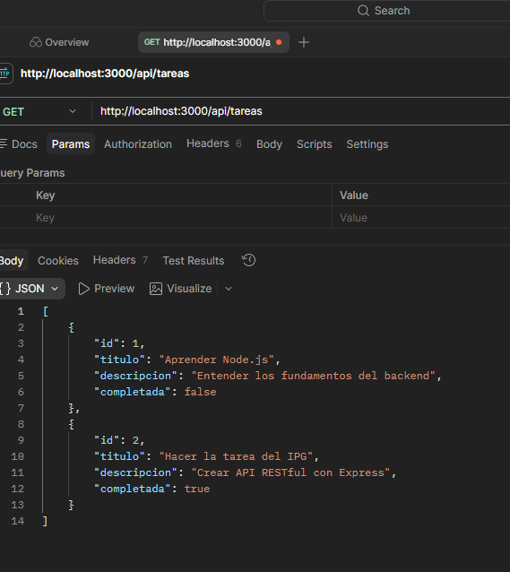
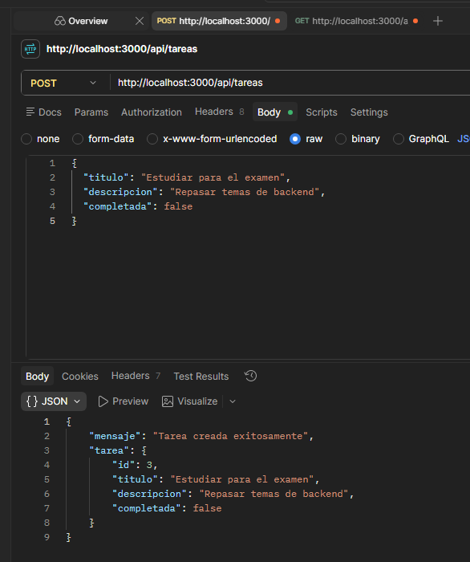
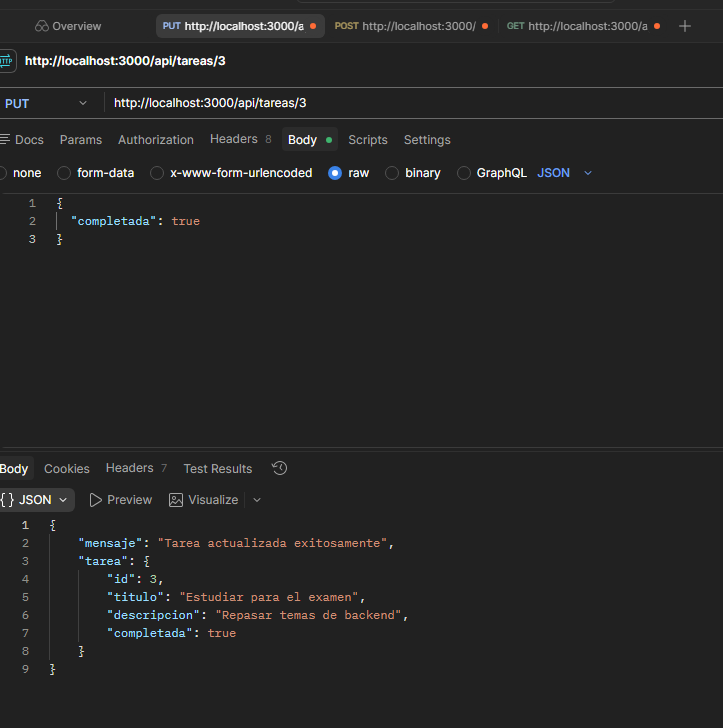
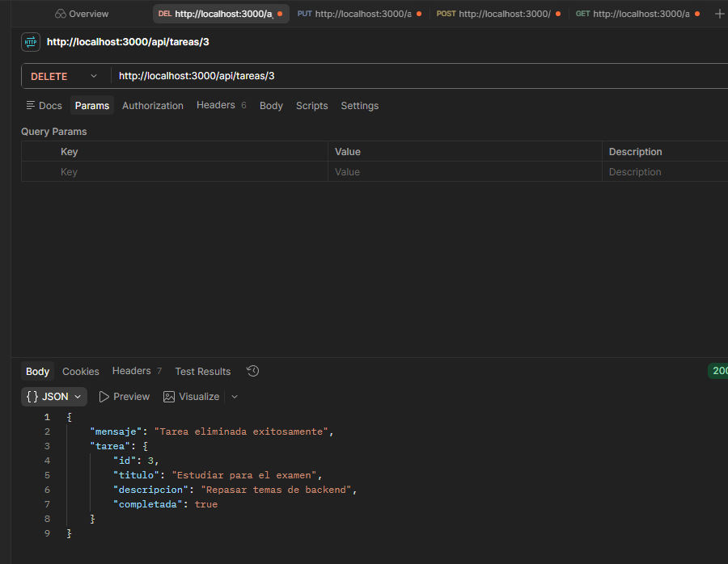

# API de Tareas (To-Do API) - Proyecto Semana 4 IPG

## Descripción

Esta es una API RESTful básica desarrollada con **Node.js** y **Express.js** que permite gestionar un conjunto de tareas mediante operaciones **CRUD** (Crear, Leer, Actualizar y Eliminar).

Los datos se almacenan temporalmente en un archivo JavaScript externo (`data.js`), sin necesidad de una base de datos externa ni autenticación.

El propósito de este proyecto es demostrar:
- La estructura básica de un servidor Express
- El manejo de rutas y métodos HTTP (GET, POST, PUT, DELETE)
- La validación de datos y manejo de errores HTTP
- El envío y recepción de datos en formato JSON

---

## Estructura del Proyecto

```
api-tareas-ipg/
├── index.js          # Servidor principal Express
├── routes.js         # Definición de rutas y lógica CRUD
├── data.js           # Array de objetos que simula la base de datos
├── package.json      # Dependencias del proyecto
├── .gitignore        # Archivos ignorados por Git
└── assets/           # Capturas de pantalla de las pruebas
    ├── 01-GET.png
    ├── 02-POST.png
    ├── 03-PUT.png
    └── 04-DELETE.png
```

---

## Instalación y Ejecución

### Requisitos previos
- Node.js instalado (versión 14 o superior)
- Git instalado

### Pasos para ejecutar

1. **Clonar el repositorio:**
   ```bash
   git clone https://github.com/pcantillana/api-tareas-ipg.git
   cd api-tareas-ipg
   ```

2. **Instalar dependencias:**
   ```bash
   npm install
   ```

3. **Iniciar el servidor:**
   ```bash
   node index.js
   ```

4. **Verificar que funciona:**
   
   El servidor estará disponible en: `http://localhost:3000/api/tareas`

---

## Pruebas de la API

A continuación se muestran las pruebas realizadas con **Postman** para cada operación CRUD:

### 1. GET → Listar todas las tareas

**Petición:**
- **Método:** GET
- **URL:** `http://localhost:3000/api/tareas`

**Respuesta esperada:**
```json
[
  {
    "id": 1,
    "titulo": "Aprender Node.js",
    "descripcion": "Entender los fundamentos del backend",
    "completada": false
  },
  {
    "id": 2,
    "titulo": "Hacer la tarea del IPG",
    "descripcion": "Crear API RESTful con Express",
    "completada": true
  }
]
```

**Evidencia:**



---

### 2. POST → Crear nueva tarea

**Petición:**
- **Método:** POST
- **URL:** `http://localhost:3000/api/tareas`
- **Body (JSON):**
  ```json
  {
    "titulo": "Estudiar para el examen",
    "descripcion": "Repasar temas de backend",
    "completada": false
  }
  ```

**Respuesta esperada:** Código HTTP `201 Created`

```json
{
  "mensaje": "Tarea creada exitosamente",
  "tarea": {
    "id": 3,
    "titulo": "Estudiar para el examen",
    "descripcion": "Repasar temas de backend",
    "completada": false
  }
}
```

**Evidencia:**



---

### 3. PUT → Actualizar tarea existente

**Petición:**
- **Método:** PUT
- **URL:** `http://localhost:3000/api/tareas/3`
- **Body (JSON):**
  ```json
  {
    "completada": true
  }
  ```

**Respuesta esperada:** Código HTTP `200 OK`

```json
{
  "mensaje": "Tarea actualizada exitosamente",
  "tarea": {
    "id": 3,
    "titulo": "Estudiar para el examen",
    "descripcion": "Repasar temas de backend",
    "completada": true
  }
}
```

**Evidencia:**



---

### 4. DELETE → Eliminar tarea

**Petición:**
- **Método:** DELETE
- **URL:** `http://localhost:3000/api/tareas/3`

**Respuesta esperada:** Código HTTP `200 OK`

```json
{
  "mensaje": "Tarea eliminada exitosamente",
  "tarea": {
    "id": 3,
    "titulo": "Estudiar para el examen",
    "descripcion": "Repasar temas de backend",
    "completada": true
  }
}
```

**Evidencia:**



---

## Manejo de Errores

La API incluye validaciones básicas y devuelve códigos HTTP apropiados:

- **400 Bad Request:** Cuando faltan campos obligatorios o los datos son inválidos
  - Ejemplo: POST sin el campo "titulo"
  - Ejemplo: POST con "completada" que no sea booleano

- **404 Not Found:** Cuando se intenta acceder a un recurso que no existe
  - Ejemplo: GET, PUT o DELETE con un ID que no existe

- **200 OK:** Operación exitosa (GET, PUT, DELETE)

- **201 Created:** Recurso creado exitosamente (POST)

---

## Decisiones de Diseño

1. **Estructura simple:** El proyecto se divide en 3 archivos principales para mantener la simplicidad y claridad del código.

2. **Validaciones básicas:** Se validan los campos obligatorios y sus tipos de datos antes de procesar las solicitudes.

3. **IDs automáticos:** Los IDs se generan automáticamente como `array.length + 1` para simplificar la creación de nuevos registros.

4. **Respuestas JSON:** Todas las respuestas se devuelven en formato JSON con mensajes claros y los datos relevantes.

5. **Códigos HTTP apropiados:** Se utilizan los códigos HTTP estándar para indicar el resultado de cada operación.

---

## Autor

**Desarrollado por:** Pablo Cantillana  
**Instituto:** Instituto Profesional IPG  
**Curso:** Programación Back End  
**Semana:** 4  
**Fecha:** Junio 2026

---

## Tecnologías Utilizadas

- **Node.js** - Entorno de ejecución de JavaScript
- **Express.js** - Framework web para Node.js
- **Git** - Sistema de control de versiones
- **GitHub** - Plataforma de alojamiento de código
- **Postman** - Herramienta para pruebas de APIs